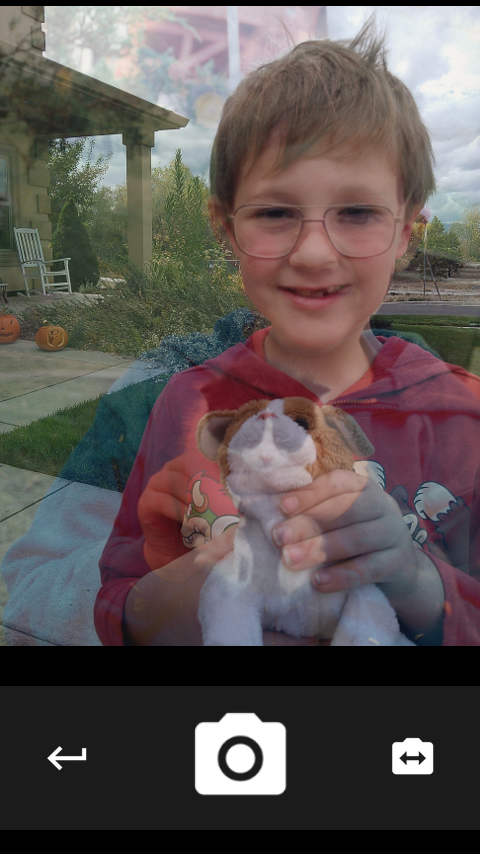
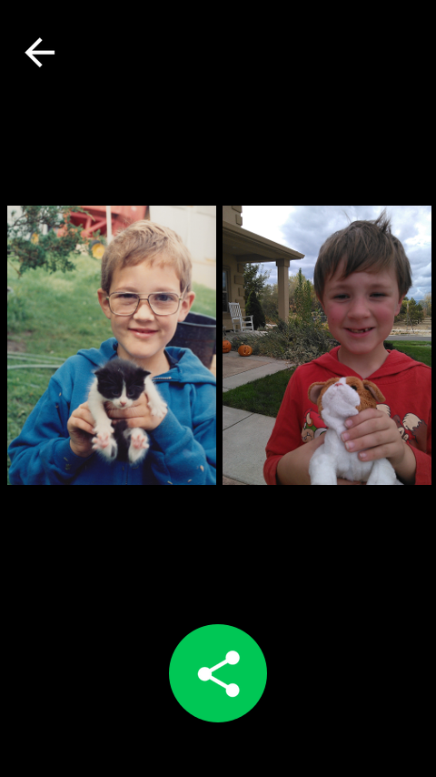

Reenact
=======

A camera app for reenacting photos: Young Me, Now Me; daily timelapses; pregnancy belly pictures -- if you need to take two pictures from the same angle, Reenact them.

Reenact can be installed on Firefox OS by visiting the Firefox Marketplace: https://marketplace.firefox.com/app/reenact/  It requires at least version 2.5 of Firefox OS.

The `/img/open-iconic/*` files are from the Open Iconic project: https://useiconic.com/open/
`/audio/shutter.opus` is from the stock Firefox OS camera app: https://github.com/mozilla-b2g/gaia/blob/master/apps/camera/resources/sounds/shutter.opus