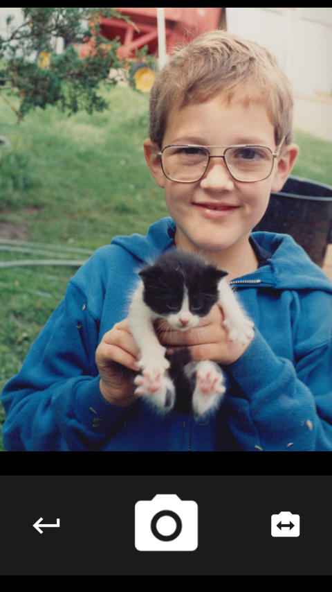

Reenact
=======

A camera app for reenacting photos: Young Me, Now Me; daily timelapses; pregnancy belly pictures -- if you need to take two pictures from the same angle, Reenact them.

Reenact can be installed on Firefox OS by visiting the Firefox Marketplace: https://marketplace.firefox.com/app/reenact/  It requires at least version 2.5 of Firefox OS.

The icons in `/img/icons/` (except the app icons and the files noted below) are from the Android Asset Studio (https://romannurik.github.io/AndroidAssetStudio/) and are licensed under the Apache license.

`/audio/shutter.opus` is from the stock Firefox OS camera app: https://github.com/mozilla-b2g/gaia/blob/master/apps/camera/resources/sounds/shutter.opus

`/web/img/icons/share-192.png` is "Share" by Agni from the Noun Project.